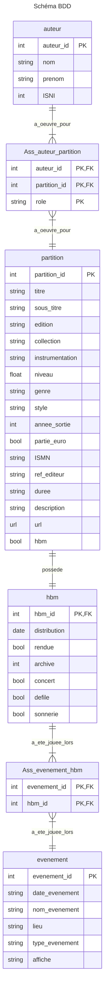

```mermaid
---
title: Schéma BDD
---

erDiagram

    auteur {
        int auteur_id PK
        string nom
        string prenom
        int ISNI
    }
    partition{
        int partition_id PK
        string titre
        string sous_titre
        string edition
        string collection
        string instrumentation
        float niveau
        string genre
        string style
        int annee_sortie
        bool partie_euro
        string ISMN
        string ref_editeur
        string duree
        string description
        url url
        bool hbm
    }
    hbm {
        int hbm_id PK, FK
        date distribution
        bool rendue
        int archive
        bool concert
        bool defile
        bool sonnerie 
    }
    evenement {
        int evenement_id PK
        string date_evenement
        string nom_evenement
        string lieu
        string type_evenement
        string affiche
    }
    Ass_auteur_partition {
        int auteur_id PK, FK
        int partition_id PK, FK
        string role PK
    }
    Ass_evenement_hbm {
        int evenement_id PK, FK
        int hbm_id PK, FK
    }

    auteur ||--|{ Ass_auteur_partition : a_oeuvre_pour
    Ass_auteur_partition }|--|| partition : a_oeuvre_pour
    hbm ||--|{ Ass_evenement_hbm : a_ete_jouee_lors
    Ass_evenement_hbm }|--|| evenement : a_ete_jouee_lors
    partition ||--|| hbm : possede

``` 